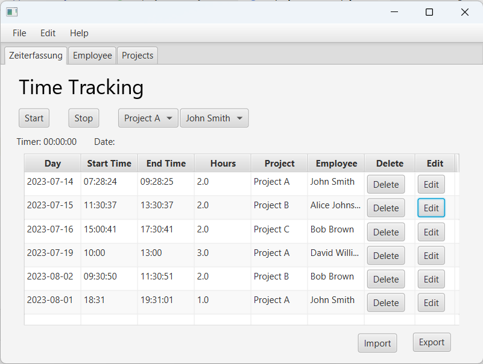

# Tracking Working Hours

The _**Tracking Working Hours**_ application is a JavaFX-based desktop app that helps users efficiently manage and track working hours for employees on different projects. It provides a user-friendly interface for recording, editing, and deleting working time entries, generating reports, and exporting data to CSV format.

## **Features**
+ Add New Working Time Entries: Record working time entries with project, employee, date, start time, and end time details.
+ Edit Existing Entries: Easily edit existing working time entries to correct any errors or update information.
+ Delete Entries: Remove unwanted working time entries from the records.
+ View and Manage Records: Access a list of all recorded working time entries in a convenient tabular format.
+ Export to CSV: Export working time records to CSV files for easy sharing and reporting.
+ Reports Generation: Generate reports to analyze employee working hours on different projects.
+ Simple and Intuitive Interface: The app features a user-friendly interface for seamless navigation and data management.
## **Requirements**
+ Java 8 or higher.
+ MySQL Database server.
## **Getting Started**
1. Clone the repository to your local machine.
1. Set up the MySQL database and import the provided SQL script to create the necessary tables and data.
1. Ensure you have Java 8 or higher installed on your machine.
1. Run the application using the provided executable JAR file or by compiling the source code.
## **How to Use**
1. Launch the application, and you will be presented with a dashboard.
1. Select "Employee" from the top menu to manage employees and their details.
1. Select "Project" from the top menu to manage projects and their information.
1. Select "Working Hours" to view, add, edit, or delete recorded working time entries.
1. Use the export button to save working time records to a CSV file for external use.
1. The app provides a user-friendly interface with intuitive controls for easy data entry and management.
## **Contributing**
Contributions are welcome! If you find any issues or have suggestions for improvements, please feel free to open an issue or submit a pull request.

## **License**
This project is licensed under the MIT License - see the LICENSE file for details.

## **Contact**
For any inquiries or support, please contact us at alibekkhudoykulov@gmail.com.

Feel free to further customize the README file with additional sections, links, and formatting to suit your project's needs and style.
